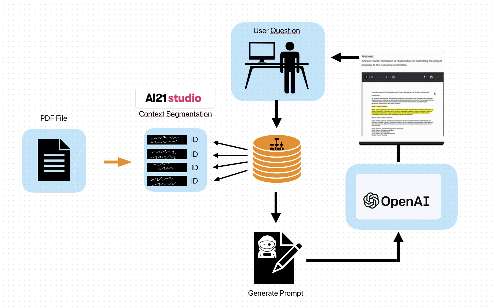

# PDF-Pilot


This is an AI-powered web application that allows users to upload PDFs, ask questions related to the content, and receive answers along with the relevant text highlighted in the PDF. 

You can quickly find answers to your questions within large PDF documents, without having to read through the entire content.


## Features

- Upload a PDF file
- Ask questions related to the PDF content
- Get answers to your questions
- View the relevant text highlighted in the PDF


## Getting Started

Follow these steps to run the web application on your local machine.

### Prerequisites

- Python 3.7+
- Node.js 12+
- Yarn or npm

### Installation

1. Clone the repository
```bash
git clone https://github.com/admineral/PDF-Pilot
```

2. Change the directory
```bash
cd PDF-Pilot
```

3. Set up a virtual environment and install the Python dependencies (pip or pip3)
```bash
python -m venv venv
source venv/bin/activate
pip3 install -r requirements.txt
```

4. Install the JavaScript dependencies
```bash
cd PDF-Pilot
npm install
```

5. Set up API keys

   a. Sign up for an [AI21 Studio](https://ai21.com/studio) account to obtain an API key.

   b. Sign up for an [OpenAI](https://beta.openai.com/signup/) account to obtain an API key.

   c. Create a `.env` file in the root directory of the project and add your API keys:

```bash
AI21_API_KEY=your_ai21_api_key
OPENAI_API_KEY=your_openai_api_key
```


### Running the Application

1. Start the Flask server in the `src` directory of the project (python or python3)

```bash
cd src
python3 server.py
```

2. Start the React development server in the root directory:

```bash
cd ..
npm start
```

3. Open a browser and navigate to `http://localhost:3000`. You should see the PDF-Pilot web application.


4. Upload a PDF, enter a question, and click "Submit" to see the AI-generated answer and the relevant text highlighted in the PDF.


## How to Run Locally

1. Edit the `main()` function in the HandoutAssistand.py (PDF-Pilot/src/HandoutAssistant.py) script to provide the path to your input PDF file and the desired output PDF file. Also, input the question you want the Handout Assistant to answer.

```python
pdf_path = "/path/to/your/input.pdf"
output_pdf = "/path/to/your/output.pdf"
question = "Your question here"
```

2. Run the script
```bash
python handout_assistant.py
```

3. The answer, relevant text, and page number will be displayed in the console. The highlighted PDF will be saved to the specified output path.


## How it Works

- PDF text extraction and AI21 context segmentation
- Context-aware question answering with OpenAI's GPT-3
- FAISS-based efficient similarity search
- Automatic highlighting of relevant text in the PDF


## How It Works in detail

1. **PDF text extraction**: HandoutAssistant.py uses the PyMuPDF library (fitz) to extract text from the PDF document. The text is then stored in a data structure with the corresponding page numbers.

2. **Text segmentation**: The extracted text is segmented into meaningful chunks using AI21 Studio's text segmentation API. These segments are assigned unique IDs and linked to their respective page numbers.

3. **Building the FAISS index**: HandoutAssistant creates a FAISS index using the segmented text and OpenAI embeddings. This index is used to search for relevant text segments efficiently.(Faiss is a library for efficient similarity search and clustering of dense vectors. It contains algorithms that search in sets of vectors)

4. **Question answering**: When a user asks a question, HandoutAssistant retrieves the most relevant text segments from the FAISS index. It then generates a prompt for OpenAI's GPT-3.5 engine, which uses the provided information to answer the question.

5. **Highlighting and page number identification**: Once the answer is generated, Handout Assistant identifies the page number and relevant text segment in the PDF. The PyMuPDF library is then used to highlight the identified text segment in the output PDF file.


Flowchart





# Code Explanation

This guide provides a step-by-step explanation of the HandoutAssistant.py code and how it processes the PDF file to answer user questions.


## 1. PDF Text Extraction

HandoutAssistant.py uses the PyMuPDF library (fitz) to extract text from the PDF document. The `PDFHandler` class has a static method called `pdf_to_text` that takes a PDF path as input and extracts the text and page number for each page.

```python
class PDFHandler:
    @staticmethod
    def pdf_to_text(pdf_path):
        doc = fitz.open(pdf_path)
        text = ""
        page_texts = []

        for page in doc:
            page_text = page.get_text("text")
            text += page_text
            page_texts.append({"text": page_text, "page_number": page.number})
        return text, page_texts
```

## 2. Text Segmentation

The extracted text is segmented into meaningful chunks using the AI21 Studio's text context segmentation API. The `AI21Segmentation` class has a static method called `segment_text` that takes the extracted text and returns a list of segments.

```python
class AI21Segmentation:
    @staticmethod
    def segment_text(text):
        url = "https://api.ai21.com/studio/v1/segmentation"
        payload = {
            "sourceType": "TEXT",
            "source": text
        }
        headers = {
            "accept": "application/json",
            "content-type": "application/json",
            "Authorization": f"Bearer {os.environ['AI21_API_KEY']}"
        }
        response = requests.post(url, json=payload, headers=headers)

        if response.status_code == 200:
            json_response = response.json()
            return json_response.get("segments")
        else:
            print(f"An error occurred: {response.status_code}")
            return None
```

## 3. Assigning Page Numbers and IDs to Segments

The `assign_page_numbers_and_ids_to_segments` method of the `HandoutAssistant` class assigns unique IDs and corresponding page numbers to each segment.

```python
def assign_page_numbers_and_ids_to_segments(self, segmented_text, page_texts):
    for idx, segment in enumerate(segmented_text):
        segment_text = segment["segmentText"]
        segment["id"] = idx + 1
        max_overlap = 0
        max_overlap_page_number = None

        for page_text in page_texts:
            overlap = len(set(segment_text.split()).intersection(set(page_text["text"].split())))
            if overlap > max_overlap:
                max_overlap = overlap
                max_overlap_page_number = page_text["page_number"]
        segment["page_number"] = max_overlap_page_number + 1
```

## 4. Building the FAISS Index

Handout Assistant creates a FAISS index using the segmented text and OpenAI embeddings. This index is used to search for relevant text segments efficiently.

```python
def build_faiss_index(self, questions_data):
    # Convert questions_data to a list of Documents
    documents = [Document(page_content=q_data["segmentText"], metadata={"id": q_data["id"], "page_number": q_data["page_number"]}) for q_data in questions_data]

    # Create the FAISS index (vector store) using the langchain.FAISS.from_documents() method
    vector_store = langchain.FAISS.from_documents(documents, self.embedder)

    return vector_store
```

## 5. Retrieving Relevant Segments

The `get_relevant_segments` method of the `HandoutAssistant` class retrieves the most relevant text segments from the FAISS index based on the user's question.

```python
def get_relevant_segments(self, questions_data, user_question, faiss_index):
    retriever = faiss_index.as_retriever()

    retriever.search_kwargs = {"k": 5}

    docs = retriever.get_relevant_documents(user_question)

    relevant_segments = []
    for doc in docs:
        segment_id = doc.metadata["id"]
        segment = next((segment for segment in questions_data if segment["id"] == segment_id), None)
        if segment:
            relevant_segments.append({
                "id": segment["id"],
                "segment_text": segment["segmentText"],
                "score": doc.metadata.get("score", None),
                "page_number": segment["page_number"]
            })
            # print the score and the element ID
            print(f"Element ID: {segment['id']}, Score: {doc.metadata.get('score', None)}")

    relevant_segments.sort(key=lambda x: x["score"] if x["score"] is not None else float('-inf'), reverse=True)

    return relevant_segments
```

## 6. Generating the Prompt

The `generate_prompt` method of the `HandoutAssistant` class constructs the OpenAI API prompt using the user's question and relevant text segments.

```python
def generate_prompt(self, question, relevant_segments):
    prompt = f"""
You are an AI Q&A bot. You will be given a question and a list of relevant text segments with their IDs. Please provide an accurate and concise answer based on the information provided, or indicate if you cannot answer the question with the given information. Also, please include the ID of the segment that helped you the most in your answer by writing <ID: > followed by the ID number.

Question: {question}

Relevant Segments:"""
    for segment in relevant_segments:
        prompt += f'\n{segment["id"]}. "{segment["segment_text"]}"'

        print(f"Relevant Element ID: {segment['id']}")  # Add this line to print the relevant element IDs
    return prompt
```

## 7. Getting the Answer and ID

The `get_answer_and_id` method of the `OpenAIAPI` class sends the prompt to the OpenAI API and returns the answer along with the ID of the most helpful text segment.

```python
def get_answer_and_id(self, prompt):
    response = openai.Completion.create(
        engine="text-davinci-003",
        prompt=prompt,
        temperature=0.5,
        max_tokens=2000,
        top_p=1,
        frequency_penalty=0,
        presence_penalty=0
    )

    answer_text = response.choices[0].text.strip()
    lines = response.choices[0].text.strip().split('\n')
    answer = lines[0].strip()
    answer = answer.replace("Answer:", "").strip()
    try:
        segment_id = int(re.search(r'<ID: (\d+)>', answer).group(1))
        answer = re.sub(r'<ID: \d+>', '', answer).strip()
    except AttributeError:
        segment_id = None
    return answer, segment_id
```

## 8. Main Execution

Finally, the main function of the script combines all these methods to process the PDF, find the relevant segments, generate a prompt, get the answer, and highlight the relevant segment in the PDF.

```python
def main():
    pdf_path = "/path/to/your/handout.pdf"
    output_pdf = "/path/to/your/output.pdf"
    question = "Your question here"

    handout_assistant = HandoutAssistant()
    answer, segment_id, segment_text, page_number = handout_assistant.answer_question(pdf_path, question)

    print(f"Answer: {answer}")
    print(f"Segment ID: {segment_id}")
    print(f"Segment Text: {segment_text}")
    print(f"Page Number: {page_number}")

    if segment_id is not None:
        handout_assistant.highlight_relevant_segment(pdf_path, output_pdf, segment_id, segment_text, page_number)
    else:
        print("No relevant segment found.")

if __name__ == "__main__":
    main()
```

With this main function, you can run the script to process the input PDF, ask a question, and receive an answer based on the relevant segments. The script will also highlight the relevant segment in the PDF, and save it as a new file with the highlighted section.
